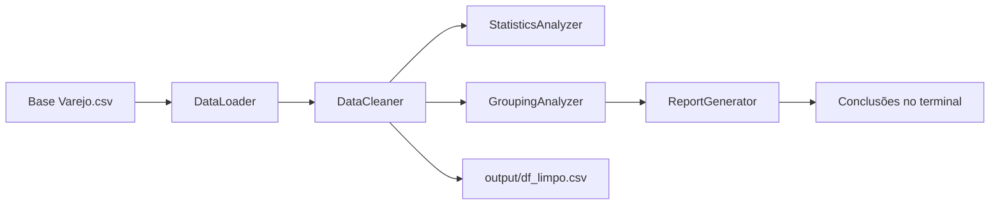

# Projeto Varejo — Análise Exploratória de Dados (AED)

Pipeline em Python para **carregar, limpar, analisar e gerar insights** sobre uma base de vendas do varejo. O projeto aplica conceitos de **Ciência de Dados** com **Pandas**: tratamento de dados, estatística descritiva, agrupamentos (`groupby`) e tabela dinâmica (`pivot_table`).

---

## Índice

- [Visão geral](#visão-geral)
- [Estrutura do projeto](#estrutura-do-projeto)
- [Pré-requisitos](#pré-requisitos)
- [Instalação](#instalação)
- [Como executar](#como-executar)
- [Base de dados](#base-de-dados)
- [Fluxo de processamento](#fluxo-de-processamento)
- [Módulos e responsabilidades](#módulos-e-responsabilidades)
- [Insights gerados](#insights-gerados)
- [Saídas do projeto](#saídas-do-projeto)
- [Possíveis evoluções](#possíveis-evoluções)

---

## Visão geral

Este repositório implementa uma **Análise Exploratória de Dados (AED)** sobre transações de varejo. O objetivo é transformar um CSV bruto em uma base confiável e extrair padrões sobre:

- perfil demográfico dos clientes (gênero, estado civil, filhos);
- categorias de produtos mais vendidas;
- cruzamentos entre gênero e categoria de produto.

O ponto de entrada é o arquivo `main.py`, que orquestra todas as etapas em sequência e imprime os resultados no terminal.

---

## Estrutura do projeto

```
projeto_varejo/
├── main.py                 # Orquestração do pipeline completo
├── data/
│   └── Base Varejo.csv     # Base original (entrada)
├── output/
│   └── df_limpo.csv        # Base tratada (gerada após execução)
└── src/
    ├── data_loader.py      # Leitura e visão geral do CSV
    ├── data_cleaner.py     # Limpeza e preparação dos dados
    ├── statistics.py       # Estatísticas da coluna CL_FHL (filhos)
    ├── grouping.py         # Agrupamentos e pivot table
    └── report.py           # Relatório final com conclusões
```

---

## Pré-requisitos

| Requisito | Observação |
|-----------|------------|
| **Python** | 3.10 ou superior (o ambiente local usa Python 3.14) |
| **pandas** | Biblioteca principal do projeto |
| **Arquivo de dados** | `data/Base Varejo.csv` deve existir no caminho esperado |

> O projeto não inclui um arquivo `requirements.txt`. A dependência necessária é apenas **pandas**.

---

## Instalação

### 1. Clonar ou baixar o repositório

```bash
git clone <url-do-repositorio>
cd projeto_varejo
```

### 2. Criar ambiente virtual (recomendado)

**Windows (PowerShell):**

```powershell
python -m venv .venv
.\.venv\Scripts\Activate.ps1
```

**Linux / macOS:**

```bash
python3 -m venv .venv
source .venv/bin/activate
```

### 3. Instalar dependências

```bash
pip install pandas
```

Para fixar a mesma versão usada no ambiente de desenvolvimento:

```bash
pip install pandas==3.0.3
```

### 4. Conferir a base de entrada

Certifique-se de que o arquivo está em:

```
data/Base Varejo.csv
```

---

## Como executar

Com o ambiente virtual ativado, na raiz do projeto:

```bash
python main.py
```

A execução imprime no console, nesta ordem:

1. Informações gerais da base (linhas, colunas, tipos)
2. Diagnóstico de nulos e duplicados
3. Log das etapas de limpeza
4. Estatísticas do número de filhos (`CL_FHL`)
5. Tabelas agrupadas por gênero, categoria e estado civil
6. Pivot table gênero × categoria
7. Relatório final com conclusões

Ao final, a base limpa é salva em `output/df_limpo.csv`.

---

## Base de dados

### Arquivo de entrada

| Propriedade | Valor |
|-------------|-------|
| Caminho | `data/Base Varejo.csv` |
| Separador | `;` (ponto e vírgula) |
| Formato de data (original) | `DD/MM/YYYY` (ex.: `01/02/2019`) |
| Volume aproximado | ~830 mil linhas na base bruta |

### Colunas utilizadas

| Coluna | Descrição |
|--------|-----------|
| `DATA` | Data da transação |
| `CO_ID` | Identificador da empresa / loja |
| `CL_ID` | Identificador do cliente |
| `CL_GENERO` | Gênero do cliente (`M`, `F`, etc.) |
| `CL_EC` | Estado civil (código numérico) |
| `CL_FHL` | Quantidade de filhos |
| `CL_SEG` | Segmento do cliente |
| `PR_ID` | Identificador do produto |
| `PR_CAT` | Categoria do produto |
| `PR_NOME` | Nome do produto |

A base original também pode conter colunas extras vazias (`Unnamed: 10`, `Unnamed: 11`, …), geradas por delimitadores `;` sobrando no final de cada linha do CSV. O pipeline remove essas colunas automaticamente.

### Arquivo de saída

| Propriedade | Valor |
|-------------|-------|
| Caminho | `output/df_limpo.csv` |
| Separador | `,` (vírgula — padrão do `to_csv`) |
| Formato de data (saída) | `YYYY-MM-DD` |
| Registros após limpeza | **304.811** linhas |

---

## Fluxo de processamento



### Etapas de limpeza (`DataCleaner`)

| Etapa | Método | Ação |
|-------|--------|------|
| 1 | `show_nulls()` | Exibe contagem de nulos por coluna |
| 2 | `show_duplicates()` | Exibe quantidade de registros duplicados |
| 3 | `remove_empty_columns()` | Remove colunas `Unnamed` |
| 4 | `treat_categories()` | Preenche `PR_CAT` vazia com `"Sem Categoria"` |
| 5 | `convert_dates()` | Converte `DATA` para `datetime` (inválidas viram `NaT`) |
| 6 | `remove_duplicates()` | Remove linhas duplicadas |
| 7 | `remove_invalid_dates()` | Remove linhas com data inválida |
| 8 | `save_clean_data()` | Salva CSV em `output/df_limpo.csv` |

---

## Módulos e responsabilidades

### `src/data_loader.py` — `DataLoader`

- Lê o CSV com `pd.read_csv(..., sep=";")`.
- Exibe quantidade de registros, colunas e tipos de dados.

### `src/data_cleaner.py` — `DataCleaner`

- Centraliza todo o tratamento da base.
- Retorna e mantém o DataFrame limpo em `cleaner.df` para as etapas seguintes.

### `src/statistics.py` — `StatisticsAnalyzer`

Analisa a coluna **`CL_FHL`** (número de filhos):

- contagem, média, mediana, moda, desvio padrão;
- mínimo, máximo e quartis (25%, 50%, 75%);
- resumo completo via `describe()`.

### `src/grouping.py` — `GroupingAnalyzer`

| Método | Agrupamento | Métrica |
|--------|-------------|---------|
| `sales_by_gender()` | `CL_GENERO` | Total de compras por gênero |
| `sales_by_category()` | `PR_CAT` | Total de vendas por categoria |
| `sales_by_marital_status()` | `CL_EC` | Total de clientes por estado civil |
| `gender_vs_category()` | `CL_GENERO` × `PR_CAT` | Pivot table (contagem) |

### `src/report.py` — `ReportGenerator`

- Recebe o DataFrame limpo e os três agrupamentos principais.
- Imprime o bloco **"CONCLUSÕES DA ANÁLISE"** com os principais achados do negócio.

---

## Insights gerados

Ao concluir o pipeline, o relatório final (`ReportGenerator`) destaca os seguintes pontos (com base na base já tratada):

### 1. Volume da base

Após limpeza (remoção de duplicatas, datas inválidas e colunas vazias), a base passa a ter **304.811 registros** válidos para análise.

### 2. Perfil por gênero

O **público feminino** concentra a maior parte das compras registradas — aproximadamente **52,7%** da base. Isso indica que estratégias de marketing e sortimento podem priorizar esse perfil, sem deixar de considerar o segmento masculino.

### 3. Categoria de produtos

A categoria **ALIMENTOS** é a mais representativa em volume de vendas. Sugere foco em estoque, promoções e layout para essa categoria no ponto de venda.

### 4. Qualidade dos dados

Existem registros com categoria **`#N/D`**, sinal de falha no cadastro ou integração de produtos. Recomenda-se revisar a origem desses valores antes de usar a base em dashboards ou modelos preditivos.

### 5. Número de filhos (`CL_FHL`)

A **mediana** de filhos é **zero**: pelo menos metade dos clientes não possui filhos cadastrados (ou tem valor zero). A análise estatística completa (média, quartis, desvio padrão) é exibida no console durante a execução.

### 6. Estado civil

O agrupamento por `CL_EC` mostra qual código de estado civil predomina na base (valores numéricos). Útil para cruzar com segmentação (`CL_SEG`) em análises futuras.

### 7. Cruzamento gênero × categoria

A **pivot table** revela quais categorias cada gênero mais consome — base para campanhas segmentadas (ex.: higiene, bebidas, alimentos).

### 8. Benefício do pipeline de limpeza

O processo elimina inconsistências estruturais (colunas fantasmas, duplicatas, datas inválidas) e padroniza categorias vazias, deixando a base pronta para **BI, dashboards ou modelos de Machine Learning**.

---

## Saídas do projeto

| Saída | Tipo | Local |
|-------|------|-------|
| Logs e tabelas | Terminal (stdout) | Durante `python main.py` |
| Base limpa | Arquivo CSV | `output/df_limpo.csv` |
| Conclusões | Texto formatado | Final da execução no terminal |

### Exemplo de registro na base limpa

```csv
DATA,CO_ID,CL_ID,CL_GENERO,CL_EC,CL_FHL,CL_SEG,PR_ID,PR_CAT,PR_NOME
2019-01-02,1000,534,M,4,1,C,67,BEBIDAS,REFRIGERANTE GUARANA
```

---

## Possíveis evoluções

Ideias compatíveis com a arquitetura atual (sem alterar o escopo já entregue):

- Adicionar `requirements.txt` com versões fixas das dependências.
- Parametrizar o caminho do CSV via argumentos de linha de comando (`argparse`).
- Exportar agrupamentos e pivot table para Excel ou HTML.
- Tratar o código `#N/D` em `PR_CAT` na etapa de limpeza.
- Visualizações com **Matplotlib** ou **Seaborn** (gráficos de barras por categoria e gênero).
- Dashboard interativo (Power BI, Streamlit ou Looker) consumindo `df_limpo.csv`.

---

## Tecnologias

- **Python 3**
- **Pandas** — manipulação, limpeza, estatística e agrupamentos

---

## Licença

Consulte o repositório ou o mantenedor do projeto para informações de licenciamento, caso aplicável.

---

## Autor

Projeto desenvolvido no contexto de **Tiago Duarte** — módulo de dados e Python.
